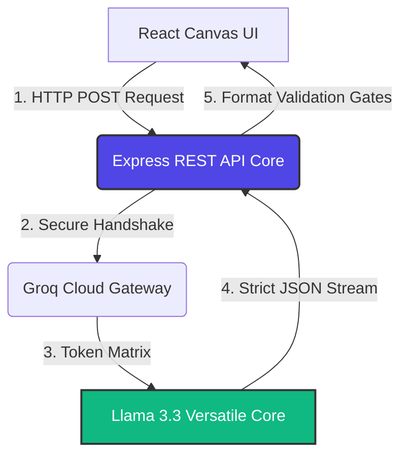

# QuickSites AI Engine 

An autonomous, infrastructure-agnostic Agentic AI code orchestration backend built for **QuickSites Solutions**. This service exposes a high-performance, secure REST API that interfaces with state-of-the-art open-weights foundation models to programmatically compile fully styled, responsive React components and layout modules on demand.

---

##  Architectural Overview

Unlike typical rigid API wrappers, the QuickSites AI Engine utilizes a modular pipeline designed to minimize token usage, handle user intent variations gracefully, and maintain extreme operational security.



### Key Engineering Features:
* **Sovereign Open-Source Core:** Powered by **Llama-3.3-70b-versatile** via the Groq Llama inference layer, eliminating vendor lock-in to closed corporate ecosystems.
* **Semantic Typo Correction:** Implements zero-token system-level instruction routing to handle human input spelling errors natively within the LLM's vector embedding space (resolves anomalies like `restatent` or `ketchin`).
* **Deterministic Output Controls:** Configured with an extreme temperature precision of `0.1` and strict JSON schema enforcement to ensure compilation-ready React components with zero markdown leaks.
* **Automated Scoping Interceptors:** Dynamically catches broad user intents (e.g., "make a website") and instructs the model to build high-conversion visual layout blueprints cleanly nested for iframes.

---

##  Tech Stack & Infrastructure

* **Runtime Environment:** Node.js (v22+)
* **Backend Framework:** Express.js (ESM Module Architecture)
* **AI Orchestration:** OpenAI Node SDK (Configured for Groq Cloud Integration)
* **Environment Management:** Dotenv (Zero-Leak Security Setup)
* **Cross-Origin Security:** CORS Middleware Configuration

---

## 📁 Repository Structure

```text
quicksites-ai-engine/
├── config/
│   └── systemInstructions.js   # Global layout rules & design system guidelines
├── controllers/
│   └── agentController.js      # Core inference logic, intent parsing, and validation gates
├── routes/
│   └── agentRoutes.js          # Unified API endpoints and route definitions
├── scripts/
│   └── chat-agent.js           # Isolated CLI prototype script for local terminal testing
├── .env.example                # Blank environment blueprint for open-source contributors
├── .gitignore                  # Strict Git ignores blocking local credential leaks
├── package.json                # Project dependencies and script automation
└── server.js                   # Application bootstrap entry point
```

##  Local Installation & Setup

### 1. Clone and Install Dependencies
```bash
git clone https://github.com/your-username/quicksites-ai-engine.git
cd quicksites-ai-engine
npm install
```

### 2. Configure Environment Variables
Create a local `.env` file at the root of the project. **Do not commit this file to Git.**

```plaintext
PORT=5001
GROQ_API_KEY=your_secured_groq_api_key_here
```

### 3. Run the Development Server
```bash
npm run dev
```

Upon a successful boot loop, your terminal will display:

`[SUCCESS] QuickSites Engine operational on port 5001`

##  API Documentation & Endpoints

###  Generate Layout Component

- **Endpoint:** `POST /api/generate`
- **Headers:** `Content-Type: application/json`
- **Request Body Schema:**

```json
{
  "userPrompt": "can you make a website for a cloud ketchin",
  "currentCode": ""
}
```

- **Successful Response Schema (`200 OK`):**

```json
{
  "layoutSummary": "Comprehensive Cloud Kitchen Homepage Layout. Automatically resolved typo 'ketchin' to 'kitchen'.",
  "componentTarget": "CloudKitchenHomepage",
  "code": "import React from 'react';\n\nconst CloudKitchenHomepage = () => {\n  return (\n    ...\n  );\n};\n\nexport default CloudKitchenHomepage;"
}
```

###  System Health Status

- **Endpoint:** `GET /health`
- **Response:** `{ "status": "active", "service": "quicksites-ai-engine" }`

##  Operational Security & Hygiene

This project enforces strict security guardrails. The sensitive `.env` file containing proprietary API configurations is explicitly untracked via `.gitignore`. A `.env.example` blueprint is exposed as an alternative configuration reference for automated deployment mapping across production pipelines (e.g., Render, Railway, or AWS).
